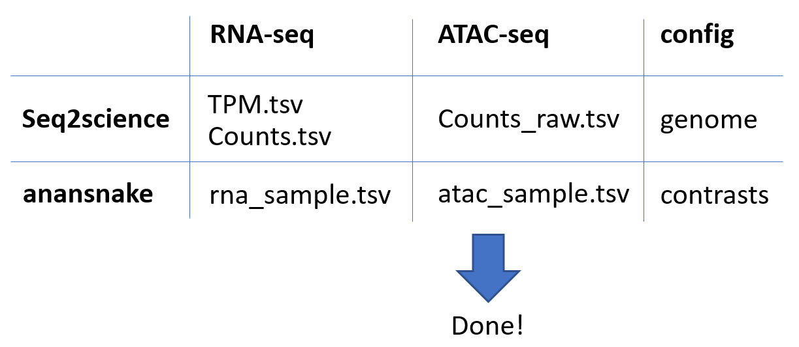

# Anansnake

Link seq2science output to ANANSE with 2 sample tables and one config file.



## Setup
1. clone this repository with `git clone https://github.com/vanheeringen-lab/anansnake.git`
2. `cd` into the anansnake directory
3. create a conda environment with `mamba env create -n anansnake -f requirements.yaml`
4. activate the conda environment with `conda activate anansnake`

Anytime you run anansnake, cd into the anansnake directory and activate the conda environment.

## Running anansnake on the example data
To check if everything is set up right, we can do a dry run:
```bash
snakemake --configfile example/config.yaml --dry-run
```
If you get an error, be sure to check the red text!
I've added human-readable feedback where I could.

With the example data, you still need to provide a genome and gene annotation.
You can download the GRCz11 genome and gene annotation with 
```bash
genomepy install GRCz11 --annotation
```
If you do another dry run you should have no more errors, and see what is going to happen.

To do the real run, you need to specify how many cores you want to use, and how much RAM you have:
```bash
snakemake --use-conda --conda-frontend mamba \
--configfile example/config.yaml \
--resources mem_mb=48_000 --cores 12
```

## Running anansnake
Anansnake works with seq2science output. The RNA- and ATAC-seq samples files are the same as you've used for seq2science, with a shared (set of) column(s) for the contrasts.

For files and settings you can use the example config.yaml.

## Troubleshooting
ANANSE can take tonnes of memory. If your machine freezes, reduce the number of threads or mem_mb.

